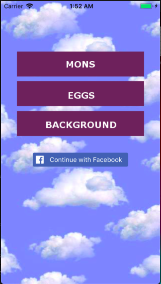
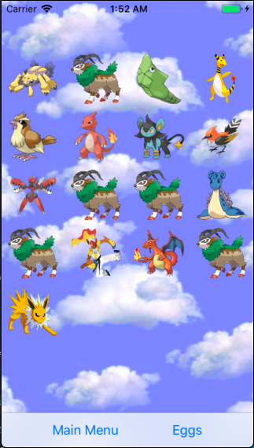
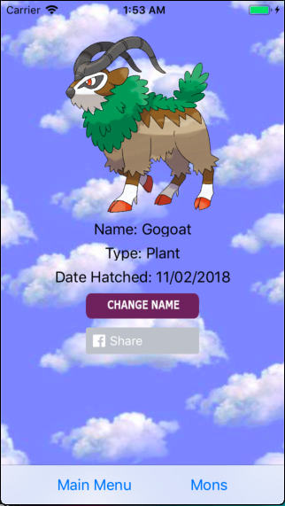
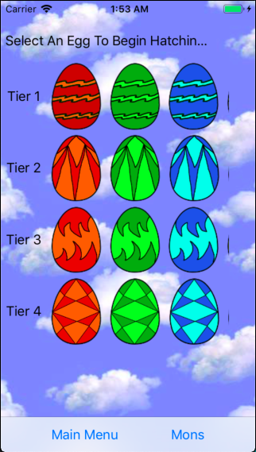
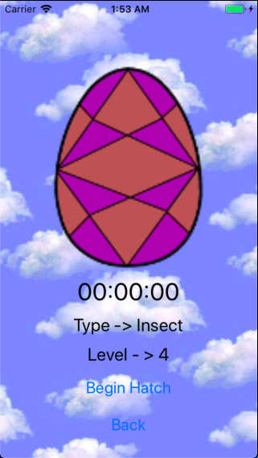

# Wait For The Mons

Sometimes you need to take a break from your phone to be more productive in real life, but it is hard when you rely on your phone as much as we do today.  
Wait For The Mons gives you an incentive to stay away from social media, cat videos, and all the other distractions your mobile device provides. 
Build a collection of cute and ferocious monsters by being productive for different stretches of time and share pictures of your new monster friends on Facebook.

## **Main Menu**

The main menu gives the opiton to log in with Facebook. This allows the user to share images of their monsters to Facebook seamlessly. The user also has the option to view their Mon collection or select a new egg to hatch.

## **Mon Collection View**
This view is home to all Mons the user has hatched in the time they have owned the app. The collection view is populated using data from the persistent store via a fetched results controller. The user can select any Mon from their collection to open a Mon detail view for further options and larger viewing of the Mon.

## **Mon Detail View**
The user can see a larger view of their Mon. The user can also permanently change the name of their Mon as well as share the picture to Facebok directly.

## **Egg Collection View**
The user is presented with three single row collection views.  Each contains the different types of eggs for that particular level of Mon (levels 1-4). When the user selects an egg to hatch, the app transitions to an egg detail view where the user begins and tracks the hatch progress on their egg. The collection views are populated from an array in the model file.

## **Egg Detail View**
The user sees a larger view of the egg they selected as well as a timer showing how long until the egg hatches.  The cancel/back button does two things depending on the state. If the button shows "Back" then it will return the user to the egg collection view. If the button shows "Cancel" it will kill the hatch, present the user with an alert, and give them the option to return to egg selection or their Mon collection.

